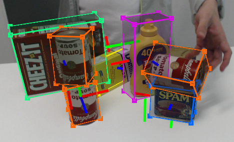

# Computer Vision 

## Main tasks 

### Object classification

The task of assigning proper labels to images among a predefined set.

### Object identification 

The task of recognizing specific instances of a class. For example it would be able to classify this picture as barak obama and not just any "human being".

### Object detection 

The detection of a specific element in an image.

### Object and instance segmentation 

Returns a mask labeling all pixels belonging to a specific class or to an instance of a class. 

### Pose estimation 

Depending on the targeted objects, for rigid object it can be their estimated position and orientation relative to the camera.
For non-rigid objects, such as human beings, it can mean the position of their limbs and the recognition of poses (seated, up, laying ect...)

### Videos 

All the concepts above can be applied to videos as well, but we won't research that part here. 

