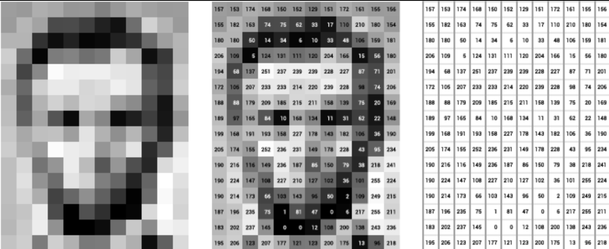
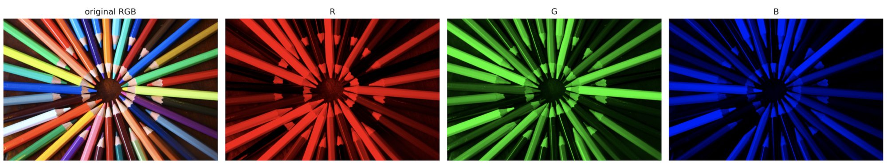

# Color theory 

## Grayscale images

Such images are made exclusively of shades of gray. The extremes are black (weakest `intensity` of contrast) and white (strongest `intensity`).

Under the hood, the images are stored as a `matrix of integers`, in which a pixel’s value corresponds to the given shade of gray. 
The scale of values for grayscale images ranges from `0` (black) to `255` (white). 

These images can be stored as a `2D matrix`. 

## RGB images 

In short, it is a model, in which shades of `red`, `green` and `blue` are added together in various proportions to reproduce colors.
The `red` `green` and `blue` are `channels`.
In comparison to the grayscale image, RGB images should be stored as a `3D np.ndarray`.
The additional dimension represents each of the 3 color `channels`.
As before, the intensity of the color is presented on a `0–255` scale. 
It is frequently rescaled to the `[0,1]` range.

