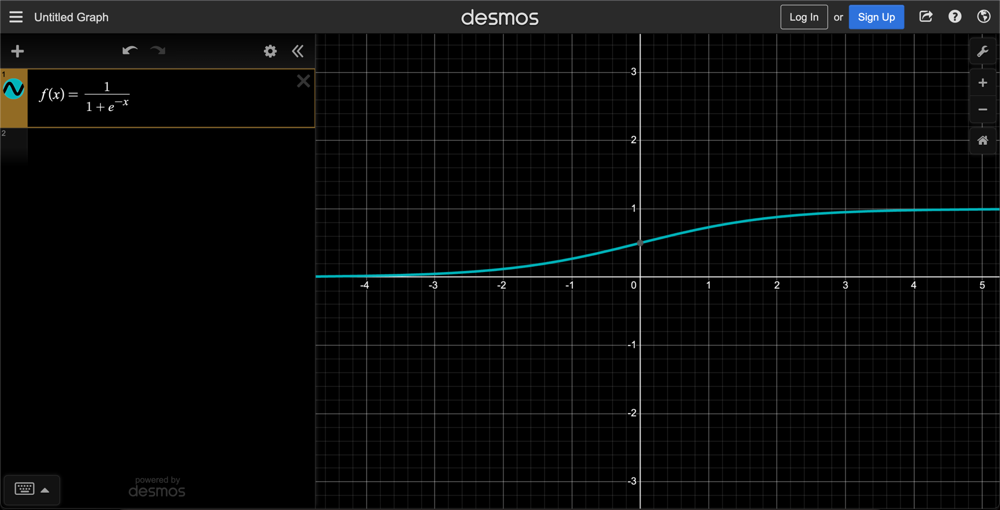
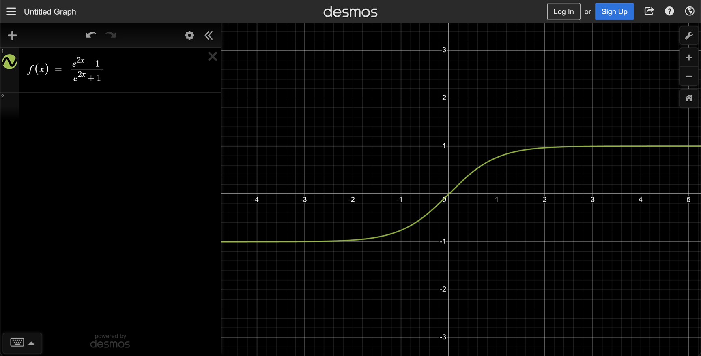
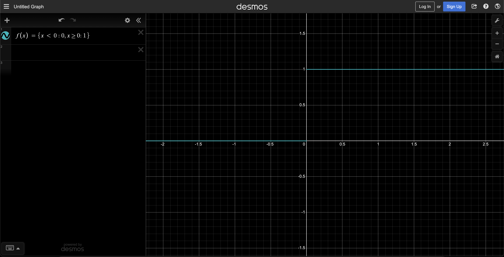

# Activation functions 

## Sigmoid function 

```
f(x) = 1 / 1 + e^-x

f(x) = e^x / e^x + 1 
```

It is a function that can take any real value and map it to between `0` to `1` shaped like the letter “S”. 
The sigmoid function also called a logistic function.



## Hyperbolic tangent (tanh)

```
f(x) = tanh(x) 

f(x) = sinh(x) / cosh(x) 

f(x) = e^2x − 1 / e^2x + 1 

f(x) = e^x - e^-x
```
Hyperbolic tangent (tanh)



Hyperbolic tangent (tanh) vs sigmoid


## REctified Linear Unit (ReLU)

```
f(x) = max(0,x)
``` 


## Binary Step

```
f(x) = { x < 0 : 0 , x >= 0 : 1 } 
```

$$f(x)=\left\{x<0:0,x>=0:1\right\}$$



## Softmax 

```
\sigma(\vec{z})_{i}=\frac{e^{z_{i}}}{\sum_{j=1}^{K} e^{z_{j}}}
```

Takes the output of a layer and returns probabilities that sump up to 1. 
It is the activation of choice for the last layer of a classification model. 
