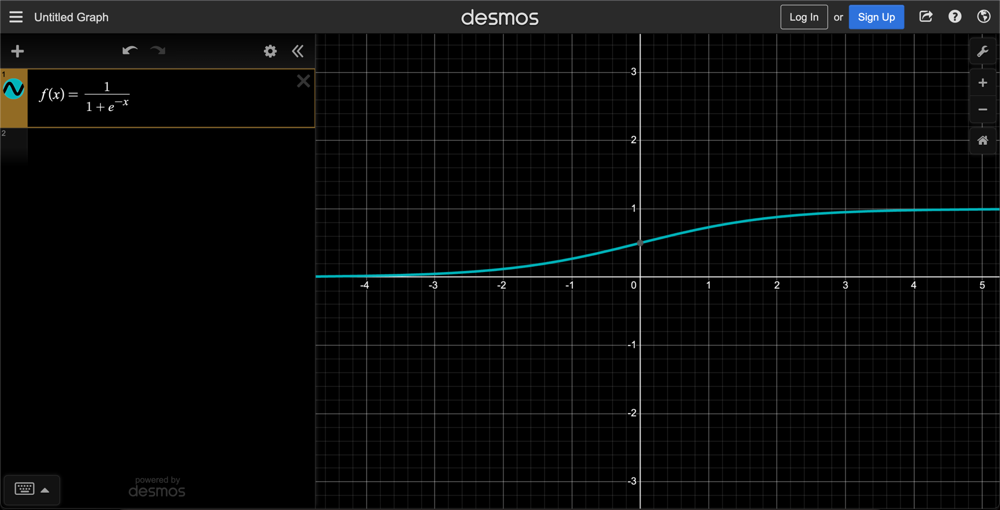
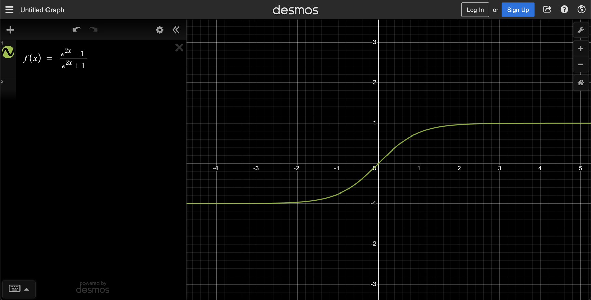
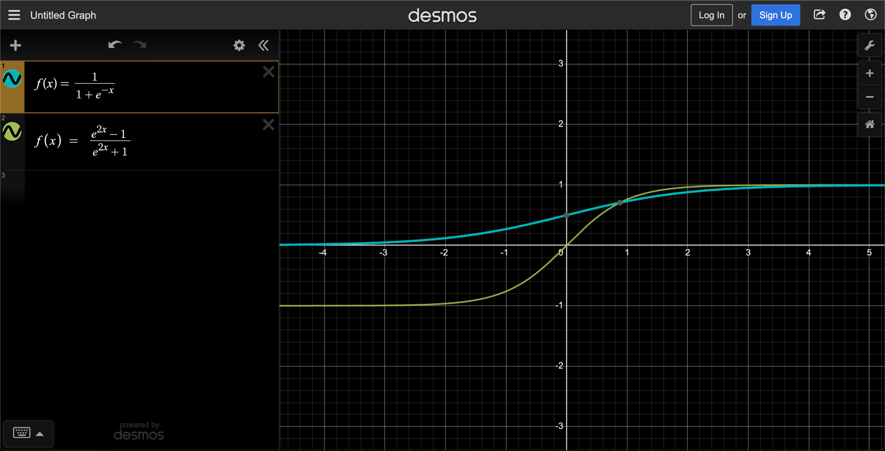
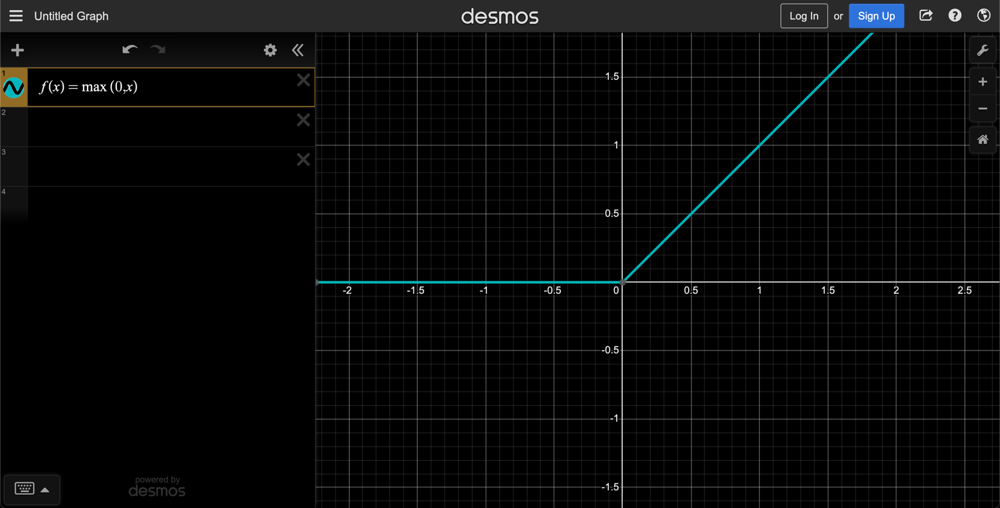
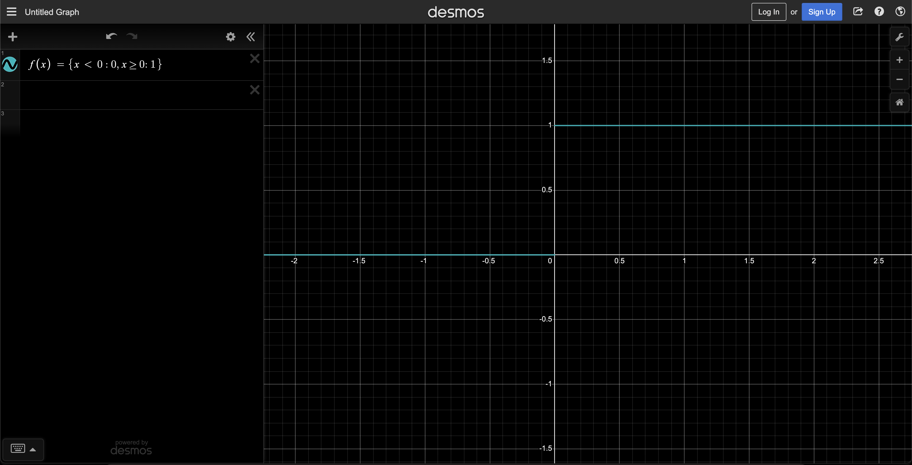

# Activation functions 

## Sigmoid function 

$$f(x) = \frac{1}{1 + e^{-x}} = \frac{e^x}{e^x + 1}$$

It is a function that can take any real value and map it to between `0` to `1` shaped like the letter “S”. 
The sigmoid function also called a logistic function.

## Hyperbolic tangent (tanh)

$$tanh(x) = \frac{sinh(x)}{cosh(x)} = \frac{e^{2x} − 1}{e^{2x} + 1} = e^x - e^{-x}$$

Hyperbolic tangent (tanh)

Hyperbolic tangent (tanh) vs sigmoid

## REctified Linear Unit (ReLU)

$$f(x) = max(0,x)$$

## Binary Step

$$f(x) = \left\{\begin{array}{ll} 0 \text{ if } x < 0 \\ 1 \text{ if } x >= 0 \end{array}\right\}$$

## Softmax 

$$\sigma(\vec{z})_{i}=\frac{e^{z_{i}}}{\sum_{j=1}^{K} e^{z_{j}}}$$

$\sigma$	=	softmax
$\vec{z}$	=	input vector
$e^{z_{i}}$	=	standard exponential function for input vector
$K$	=	number of classes in the multi-class classifier
$e^{z_{j}}$	=	standard exponential function for output vector
$e^{z_{j}}$	=	standard exponential function for output vector

Takes the output of a layer and returns probabilities that sump up to 1. 
It is the activation of choice for the last layer of a classification model. 
