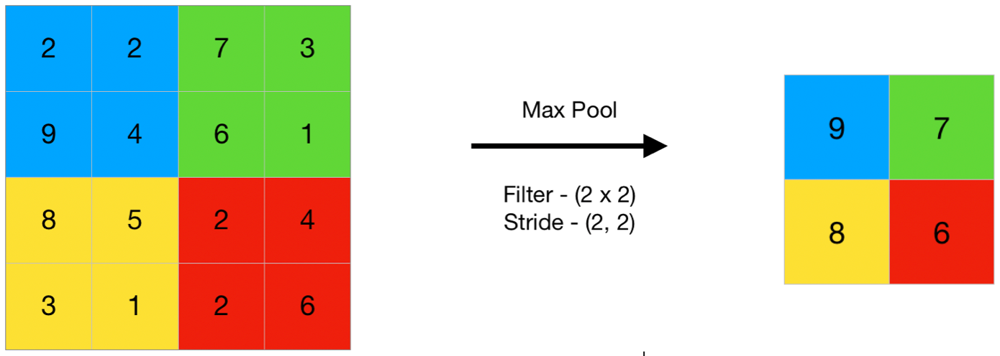

# Layer Types

## Dense

A dense layer is a type of layer that multiplies its inputs by a matrix (called weights) and then adds a number (called the bias) to the result.

## Conv2d

You can build an image classifier using only dense layers, however, convolutional layers have proven effective for many image based tasks.

- [Image Kernels Explained Visually](https://setosa.io/ev/image-kernels/)
- [Convolutional Neural Networks for Visual Recognition](https://cs231n.github.io/convolutional-networks/)

## MaxPooling2d

Downsampling using max values in an image region instead of averaging.

