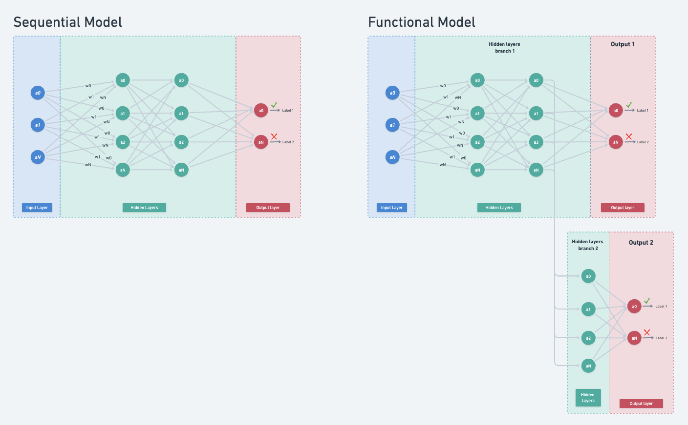

# Models types

## Sequential models vs functional models 

A sequential model has its inputs flow straight down to its output.

Other kinds of models (for example functional) can have branches, or even multiple inputs and outputs, but in many cases your models will be sequential. 

Sequential models also have an easier to use API.

