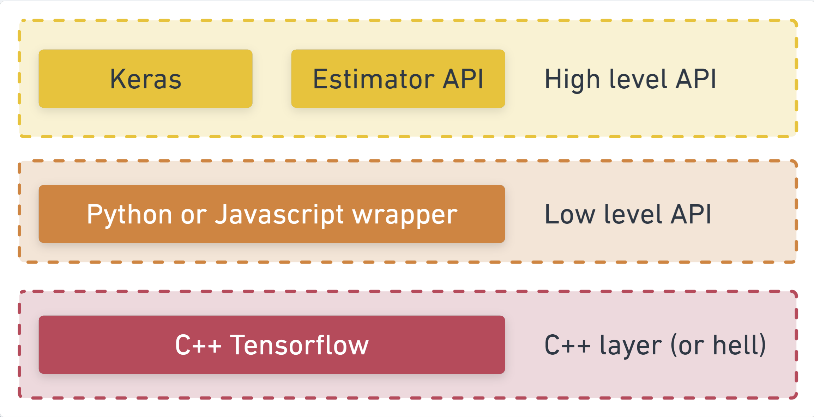
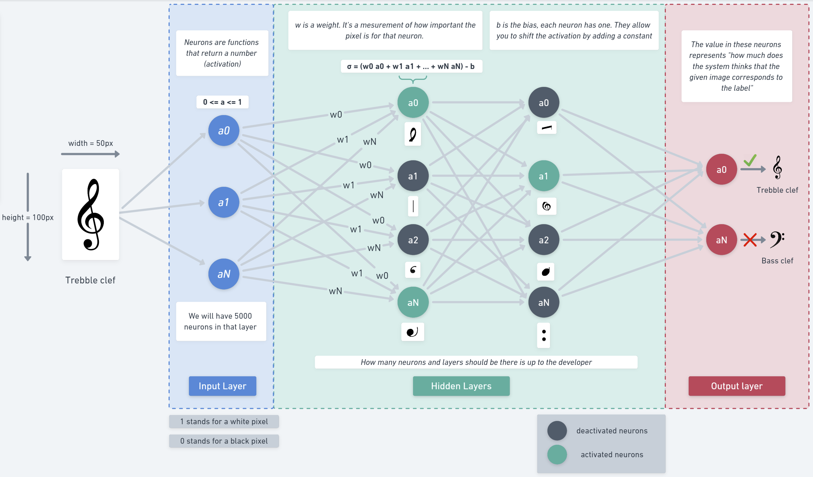
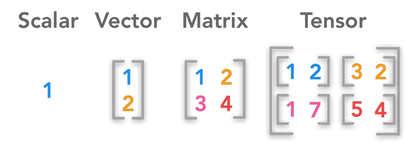

# [TensorFlow](https://www.tensorflow.org/)

# Introduction

It offers the deployment of machine learning solutions to various platform : computer CPUs, computer GPUs, mobiles devices, web browsers. 
It also offers functions for creating machine learning models. 

Most deep learning computations are coded in C++. 
To run operations on the GPU, TensorFlow uses a library developed by NVIDIA called [CUDA](CUDA.md).
This is why you need to install it if you want to use your GPU capabilities and why you can't use GPU from another manufacturer. 



# Terminology

## Dataset

The data we want to train the model on.
If there is no structure (patterns) in the data (i.e. the data is random), the model won't really be able to learn anything.
We are going to feed a lof of examples, to a neural network that will learn from these examples a formula (or function) to predict something. This learning from examples for which we have the correct answers is called Supervised Learning.

## Models

It usually refers to the neural network that was trained on data. 
It is composed of an `arquitecture`, `matrix weights` and `parameters`

The `architecture` is just a fancy way of saying "which functions will the model run when it is executing",
or alternatively "what algorithm will our model uses to compute its answers".

- [See types of models](model_types.md)

You will create a sequential model like so :

```ts
const model = tf.sequential();
```

### Layers

- [See types of layers](layer_types.md)

You can add an input dense layer to a model like so :

```ts
model.add(tf.layers.dense(
    {
      inputShape: [1], 
      units: 1, 
      useBias: true
    }
));

// inputShape : Dimensions and elements your input tensor has. [30,4,10] = 3 dimensions, of 30 elements in the first, 4 in the second and 10 in the third.
// units : number of neurons on the layer
// useBias : defaults to true 
```

You could add an output layer with just one number as output like so : 
```ts
model.add(tf.layers.dense({units: 1})); 
```

[Gradient descent, how neural networks learn | Chapter 2, Deep learning](https://www.youtube.com/watch?v=IHZwWFHWa-w&ab_channel=3Blue1Brown)

## Neural Networks

When using neural networks, the algorithm is a set of layers of neurons with ‘weights' (numbers) governing their output. The training process learns the ideal values for those weights.

[But what is a neural network? | Chapter 1, Deep learning](https://www.youtube.com/watch?v=aircAruvnKk&t=963s&ab_channel=3Blue1Brown)



## Tensors

The primary data structure in TensorFlow programs.
Tensors are N-dimensional (where N could be very large) data structures, most commonly scalars, vectors, or 3D matrices or N-dimensional matrices.
The elements of a Tensor are : 
- Its type :  `integer`, `floating-point`, or `string` ...
- Its shape : The dimensions of the data, for example : `()` for scalar, `(n)` for vectors, `(n,m)` for 2D matrix of size `n x m` 
- Its rank : number of dimensions `0` for scalar, `1` for vector, `2` for 2D matrix.



