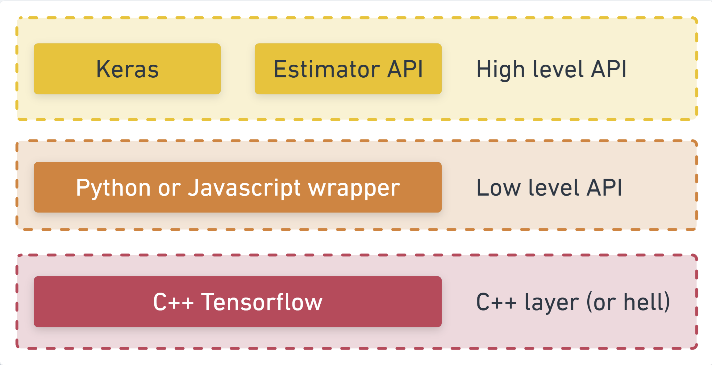
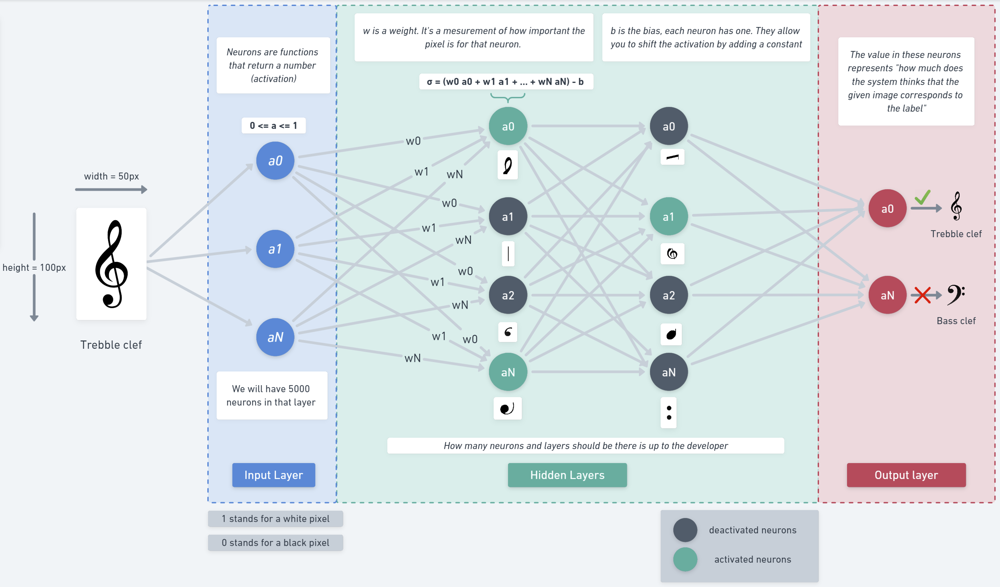

# [TensorFlow](https://www.tensorflow.org/)

# Introduction

It offers the deployment of machine learning solutions to various platform : computer CPUs, computer GPUs, mobiles devices, web browsers. 
It also offers functions for creating machine learning models. 

Most deep learning computations are coded in C++. 
To run operations on the GPU, TensorFlow uses a library developed by NVIDIA called [CUDA](CUDA.md).
This is why you need to install it if you want to use your GPU capabilities and why you can't use GPU from another manufacturer. 



# Terminology

## Dataset

The data we want to train the model on.
If there is no structure (patterns) in the data (i.e. the data is random), the model won't really be able to learn anything.
We are going to feed a lof of examples, to a neural network that will learn from these examples a formula (or function) to predict something. This learning from examples for which we have the correct answers is called Supervised Learning.

## Models

It usually refers to the neural network that was trained on data. 
It is composed of an `arquitecture`, `matrix weights` and `parameters`

The `architecture` is just a fancy way of saying "which functions will the model run when it is executing",
or alternatively "what algorithm will our model uses to compute its answers".

### Types of models

#### Sequential models

A model where its inputs flow straight down to its output. 

Other kinds of models can have branches, or even multiple inputs and outputs, but in many cases your models will be sequential. Sequential models also have an easier to use API.


### Layers

#### Types of layers

##### Dense

A dense layer is a type of layer that multiplies its inputs by a matrix (called weights) and then adds a number (called the bias) to the result.

##### Conv2d

You can build an image classifier using only dense layers, however, convolutional layers have proven effective for many image based tasks.

- [Image Kernels Explained Visually](https://setosa.io/ev/image-kernels/)
- [Convolutional Neural Networks for Visual Recognition](https://cs231n.github.io/convolutional-networks/)

### Prepare for training

```js
model.compile({
  optimizer: tf.train.adam(),
  loss: tf.losses.meanSquaredError,
  metrics: ['mse'],
})
```

`optimizer`: This is the algorithm that is going to govern the updates to the model as it sees examples.
There are many optimizers available in TensorFlow.js.
Here we have picked the adam optimizer as it is quite effective in practice and requires no configuration.

`loss`: this is a function that will tell the model how well it is doing on learning each of the batches (data subsets) that it is shown.
Here we use `meanSquaredError` to compare the predictions made by the model with the true values.
When training a model we want to see the loss go down. In this case, because our metric is a measure of error, we want to see it go down as well.

[Gradient descent, how neural networks learn | Chapter 2, Deep learning](https://www.youtube.com/watch?v=IHZwWFHWa-w&ab_channel=3Blue1Brown)

## Neural Networks

When using neural networks, the algorithm is a set of layers of neurons with ‘weights' (numbers) governing their output. The training process learns the ideal values for those weights.

[But what is a neural network? | Chapter 1, Deep learning](https://www.youtube.com/watch?v=aircAruvnKk&t=963s&ab_channel=3Blue1Brown)



## Tensors

The primary data structure in TensorFlow programs.
Tensors are N-dimensional (where N could be very large) data structures, most commonly scalars, vectors, or 3D matrices or N-dimensional matrices.
The elements of a Tensor are : 
- Its type :  `integer`, `floating-point`, or `string` ...
- Its shape : The dimensions of the data, for example : `()` for scalar, `(n)` for vectors, `(n,m)` for 2D matrix of size `n x m` 
- Its rank : number of dimensions `0` for scalar, `1` for vector, `2` for 2D matrix.


### Best practices

#### Shuffle your data

We should randomize the order of the examples we will feed to the training algorithm.
Shuffling is important because typically during training the dataset is broken up into smaller subsets, called batches, that the model is trained on.
Shuffling helps each batch have a variety of data from across the data distribution.

By doing so we help the model:

- Not learn things that are purely dependent on the order the data was fed in
- Not be sensitive to the structure in subgroups
  (e.g. if it only see high horsepower cars for the first half of its training it may learn a relationship that does not apply across the rest of the dataset).

#### Normalize the data

Normalization is important because the internals of many machine learning models you will build with tensorflow.js are designed to work with numbers that are not too big.
Common ranges to normalize data to include `0` to `1` or `-1` to `1`.
You will have more success training your models if you get into the habit of normalizing your data to some reasonable range.
