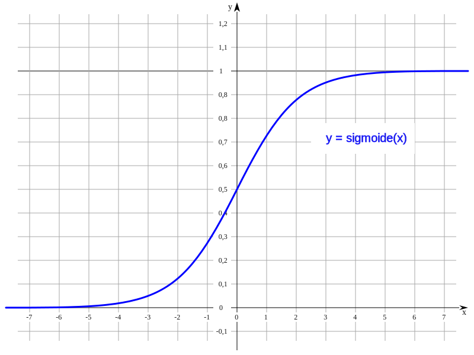
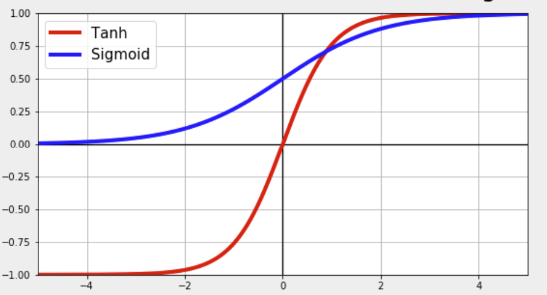
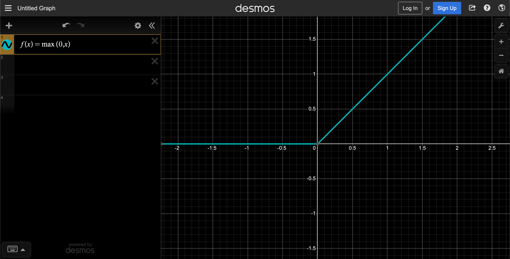

# Maths

# Activation functions 

## Sigmoid function 

It is a mathematical function having a characteristic that can take any real value and map it to between `0` to `1` shaped like the letter “S”. 
The sigmoid function also called a logistic function.

## Hyperbolic tangent (tanh)

## REctified Linear Unit (ReLU)

## Binary Step

